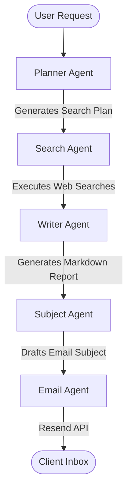

# Deep Research Orchestrator


https://github.com/user-attachments/assets/1b84ec4f-73cd-4969-bf01-a3f063ad71ea


This project is an AI-powered deep research assistant. It leverages an **Agent Orchestration** pattern to break down complex research queries into a multi-step workflow. Instead of relying on a single AI model to try and answer a broad question, this system uses specialized agents to plan a research strategy, execute web searches, synthesize findings into a comprehensive markdown report, and finally email the report to a designated recipient.

The backend is built with **FastAPI** and uses a Newline Delimited JSON (NDJSON) stream to send real-time progress updates to a sleek **React + Vite** frontend.

## The Agent Framework

This project leverages the `agents` Python SDK to create specialized agents for each step of the research workflow. 

Here is a snippet showing how we assemble the agents:

```python
from agents import Agent

# Define the specialized agents for each phase
planner_agent = Agent(name="Planner Agent", instructions=planner_instructions, model="gpt-5.4-mini")
search_agent = Agent(name="Search Agent", instructions=search_instructions, tools=[tavily_search], model="gpt-5.4-mini")
writer_agent = Agent(name="Writer Agent", instructions=writer_instructions, model="gpt-5.4-mini")
email_agent = Agent(name="Email Agent", instructions=email_instructions, tools=[send_email_tool], model="gpt-5.4-mini")
subject_agent = Agent(name="Subject Agent", instructions=subject_instructions, model="gpt-5.4-mini")
```

## How it Works (Agent Orchestration)

When a research query is submitted, the workflow sequentially orchestrates the agents to produce the final result.



### 1. Planning Phase
The **Planner Agent** analyzes the user's initial query and generates a structured plan of specific web searches required to gather comprehensive information.

### 2. Searching Phase
The **Search Agent** takes the plan and executes the web searches using the Tavily Search API. It gathers real-time, up-to-date information from the internet.

### 3. Synthesis Phase
The **Writer Agent** takes the original query and all the accumulated search results to synthesize a detailed, well-structured Markdown report along with a short summary.

### 4. Emailing Phase
Finally, the **Subject Agent** generates a professional email subject line based on the report, and the **Email Agent** formats and sends the complete report via the Resend API to the target inbox.

## Getting Started

### Prerequisites
1. Create a `.env` file in the root directory (and `frontend/.env`) with your API keys:
   ```env
   # Backend APIs
   OPENAI_API_KEY=your_openai_api_key
   TAVILY_API_KEY=your_tavily_api_key
   RESEND_API_KEY=your_resend_api_key
   TO_EMAIL_ADDRESS=target@example.com
   FROM_EMAIL_ADDRESS=Deep Research <no-reply@devorbit.live>
   ```

2. Ensure you have run `npm install` inside the `frontend` folder, and installed your Python requirements in the `backend` folder.

### Running the Application

You can run the backend and frontend separately using the provided scripts:

**1. Start the Backend:**
```bash
./start_backend.sh
```
This will start the FastAPI backend on `http://localhost:8001`.

**2. Start the Frontend:**
```bash
./start_frontend.sh
```
This will start the React frontend on `http://localhost:5173` (or 5174/5175 if busy).

Navigate to `http://localhost:5173` in your browser to start your deep research!
